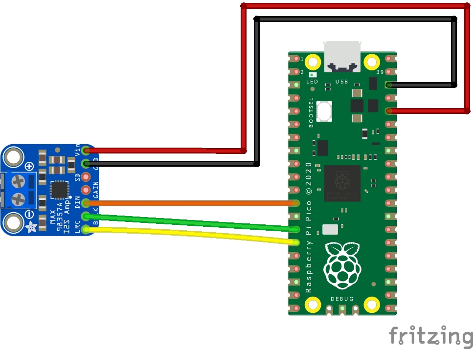

## Raspberry Pi Pico - WAV sound file player

Using CircuitPython on a Raspberry Pi Pico we can play short clips of sounds.To acquire good quality sound we will use I2S audio (DAC). The Raspberry Pico does not have I2S hardware. The team at Adafruit industries has created the necessary modules to achieve I2S audio in CircuitPython. 

### Hardware
- Raspberry Pi Pico
- MAX98357A I2S amplifier
- Speaker

### Software:
- CircuitPython 7.+ Download the latest firmware at the [official site](https://circuitpython.org/board/raspberry_pi_pico/)

### Sound file preparation

- The Raspberry Pico has 2MB of on-board Flash memory. Sound files must be under 2MB
- CircuitPython supports mono or stereo, at 22 KHz sample rate (or less) and 16-bit WAV format 
- I used sox and ffmpeg to prepare modifications of my sound file

```bash
# Install necessary software in linux
sudo apt-get install mediainfo ffmpeg sox

# verify sound file properties wih mediainfo
mediainfo file.wav

# change file to 16 bits with sox
sox input_24bits.wav -b 16 output_16bits.wav

# It is recommended to use the -bitexact flag when changing sample rates or file lengths
# Careful with bitrates. Lower bitrates causes loss of high frequency sounds
ffmpeg -i input_48kHz.wav -bitexact -ar 16000 output_16kHz.wav

# To help reduce file size, change stereo output to mono using the -ac flag
ffmpeg -i input_stereo.wav -ac 1 output_mono.wav

# example of cropping file length starting at 1 second, ending at 9 seconds
ffmpeg -i input_60s.wav -ss 00:00:01 -to 00:00:09 output_8s.wav

# example of augmenting volume by 10dB with ffmpeg
ffmpeg -i input.wav -filter:a "volume=10dB" output.wav

# example of high-pass filtering (I did this for birds, to remove the atmospherique bass tones)
# The low pass frequency is pretty high in this example
ffmpeg -i output.wav -af "highpass=f=500, lowpass=f=7000" high_pass.wav

```

### Hookup guide:



### References:
- [In-depth tutorial](https://www.recantha.co.uk/blog/?p=20950)
- [CircuitPython Audio file preparations](https://learn.adafruit.com/circuitpython-essentials/circuitpython-audio-out#play-a-wave-file)
- [CircuitPython Audiocore Wiki](https://circuitpython.readthedocs.io/en/latest/shared-bindings/audiocore/index.html#audiocore.WaveFile)
- [ffmpeg audio volume manipulation](https://trac.ffmpeg.org/wiki/AudioVolume)
- [sox audio conversions](https://www.nesono.com/node/275)
